# GRUNT TRACKER

Hello! This app was designed as a learning project for myself- in fact my very first full stack project (MERN).

_...and my oh my did I learn._

## What is "Grunt Tracker"?

Grunt Tracker is an app that will (eventually) help small unit leaders keep better accountability of their Marines. I define accountability as:

1.  **Physical** _(are they here?)_
2.  **Appointment** _(where do they have to be?)_
3.  **Equipment** _(what are they supposed to have?)_
4.  **Performance** _(how are they doing?)_

The app strives to make some of the more logistical and tedious parts of a small unit leaders job a bit more automated, letting them focusing on what really matters: **building a high-performance team that can locate, close with, and destroy the enemy's of our glorious country!**

## What was the process like?

The process was awesome.
...from an idea ...to a **mindmap** ...to **user stories** ...to the **development process**... and finally something I could call `v1.0.0` !

There are a **_ton of things I would change and equally as many mistakes_**. Being on deployment while I was learning all of these new concepts and technologies had me always advancing ahead of what I had already done. I would also have to leave the project for a month at a time to come back and try and pick up where I left off. Noticing mistakes I had made. Resisting the urge to wipe it and start over. Rather than throw it out and start anew, I kept pushing!

I still have a long way to go with it. As I become more proficient in this art, I will keep making it better. I hope to one day rewrite it in React Native and make it a living, breathing app on the app store that will help out my fellow grunts! Many features I am excited to introduce as well:

- **Export to .CSV template** for easy kill cards/rosters
- **Login/authorization** to make the app something that you can actually use
- **Counseling Notes** to make it stupid easy to create monthly counselings based on notes you've taken throughout the month
- **"Do Good List"** to remember those individuals who _put out_

_...and many more_

## Screenshots

| Homescreen                                       | Add Existing Marine                             | Add Marine                                              | Add Existing (None)                                    |
| ------------------------------------------------ | ----------------------------------------------- | ------------------------------------------------------- | ------------------------------------------------------ |
| 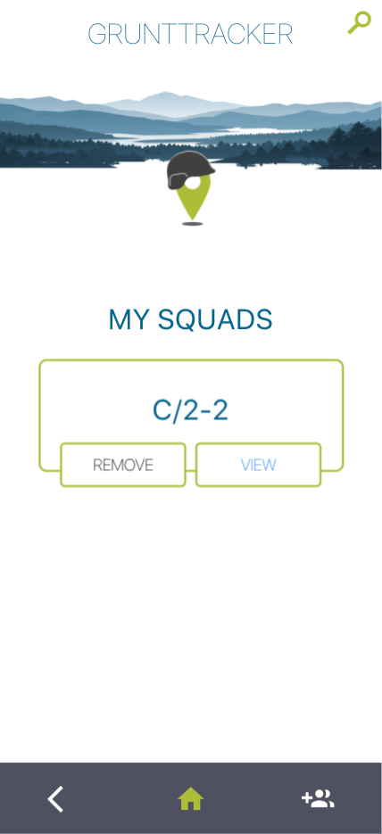 | 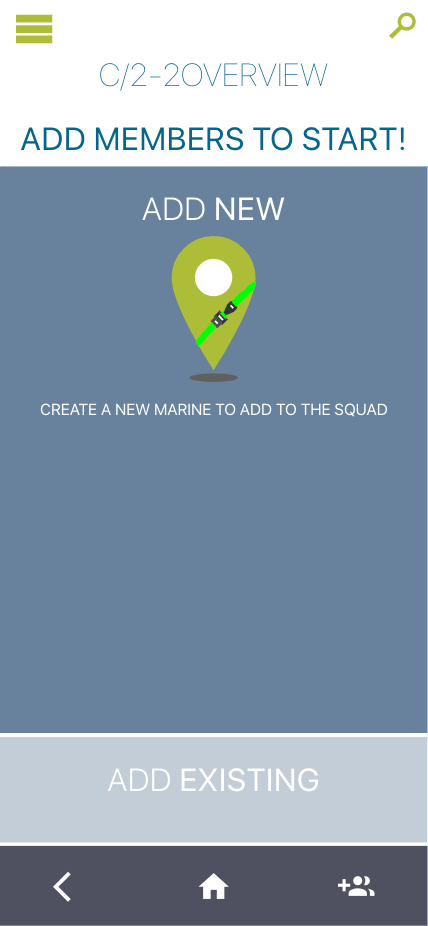 | 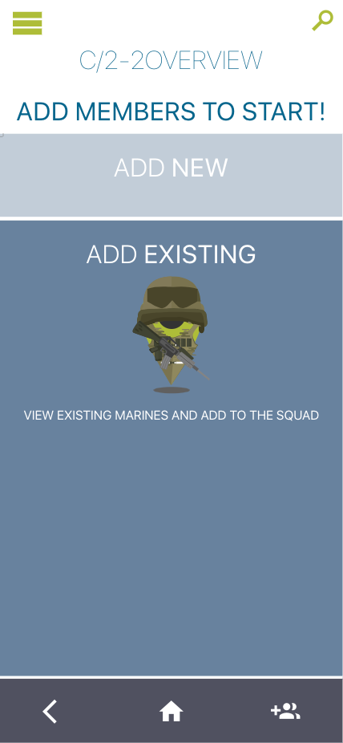 | 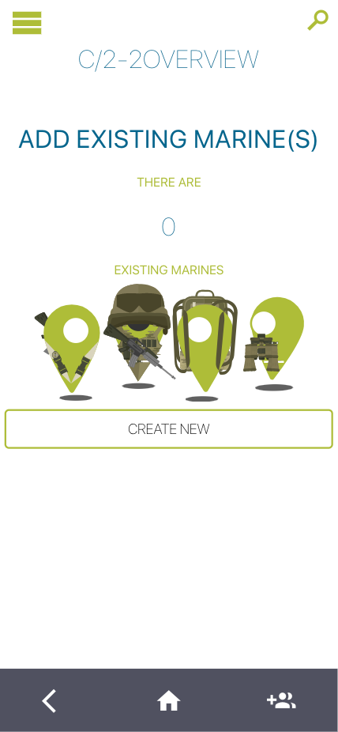 |

| Squad Accountability                                     | Squad EDL                                          | Squad Appointments                                    | Squad Edit                                          |
| -------------------------------------------------------- | -------------------------------------------------- | ----------------------------------------------------- | --------------------------------------------------- |
| 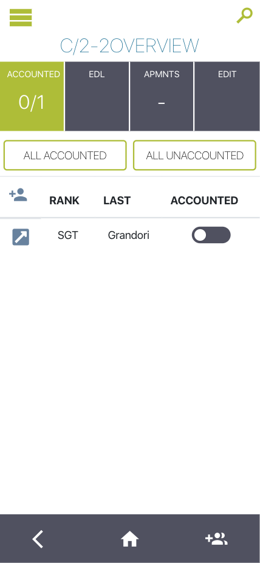 | 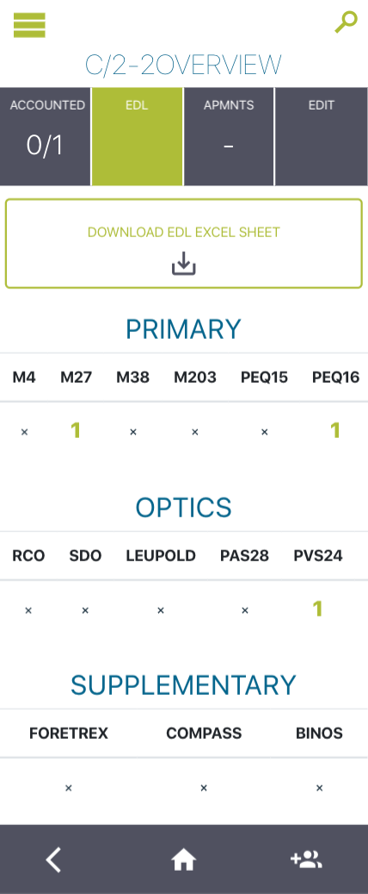 | 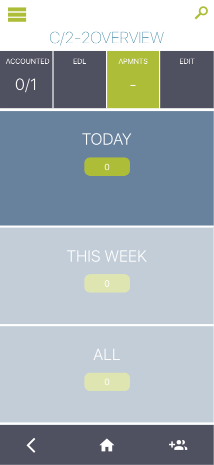 | 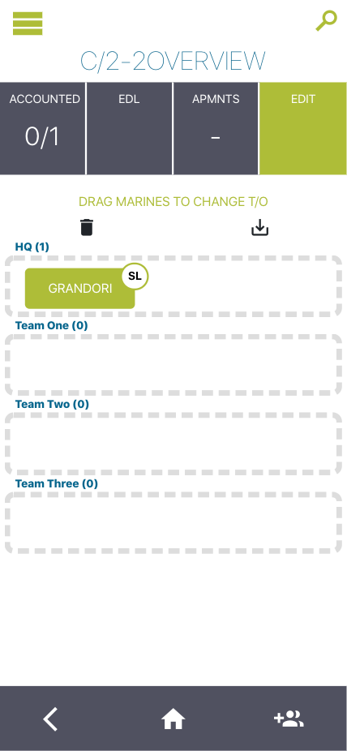 |

| Marine Accountability                                               | Marine EDL                                                    | Marine EDL (edit)                                             | Marine Body (view)                                             |
| ------------------------------------------------------------------- | ------------------------------------------------------------- | ------------------------------------------------------------- | -------------------------------------------------------------- |
| 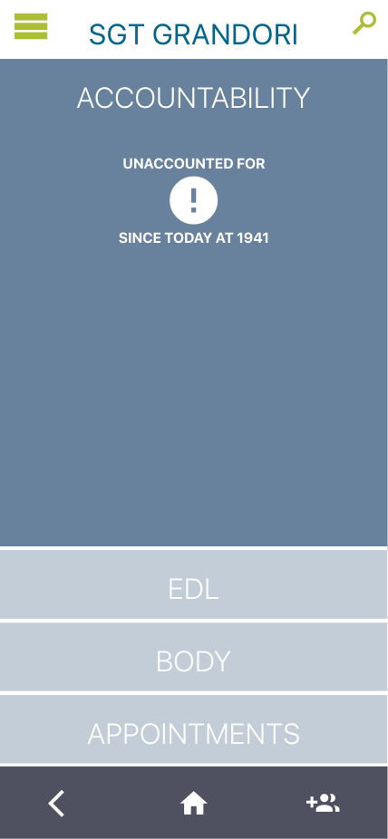 | 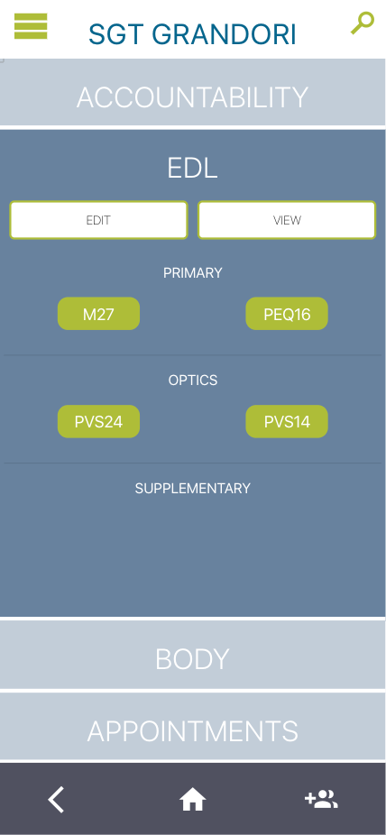 | 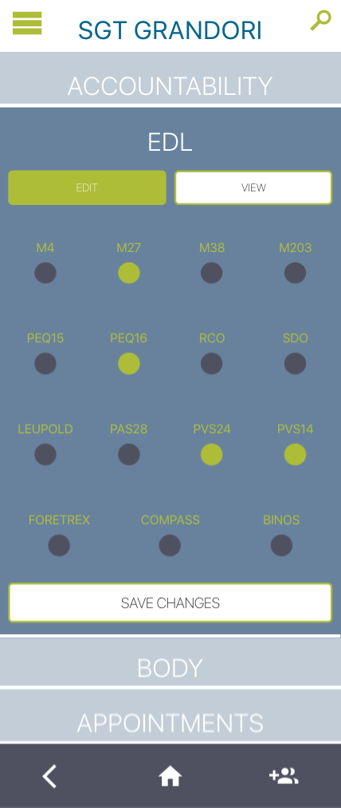 |  |

Test\*\*
