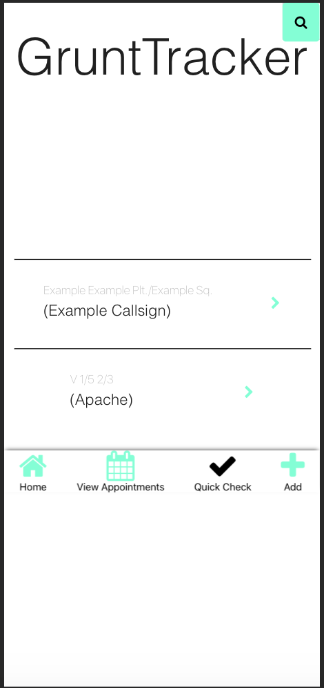

# GruntTracker

## 11/24 Update

- Added bootstrap to the project to help with rapidly prototyping things without having to spend time using `styled-components`. Will eventually
- continue to build on the existing reusable components I started with. 
- Got rid of the overview card for now until I am sure of exactly what data to display.
- At the point now where I can really start updating my `Marine` schema and adding a bunch of mock data to work with.

### TODO:
- Finish the `CreateAppointment` component so that the it can be utilized on the overview card as well as in the individual Marine's profile. Should display some details about the appointment along with the date.
- Create a `Weapons` schema to house serialized weapons and optics and use it as a child of `Marine`

## 11/19 Update

- Started to rework some small components to better suit the new focus (utilizing the Marine collection)
- Moved search feature away from center of app

### TODO:
- Need to build out the component library a bit more so I have more reusable components to easily move into place to try concepts.
- I want to get all current features working (appointments, accountability, basic information) and then figure out how to utilize that information in the best way possible before expanding on it.

## 11/13 Update

- Created simple bottom nav
- Reworking schema and data structure to better suit user stories

### TODO: 
- Remove uneccesary components that are now staged on one `screen` component
- Add a lot of information to `marines` schema and clean up API. Idea is the majority of the information I will be querying from database will come from this collection rather than `squads` 

